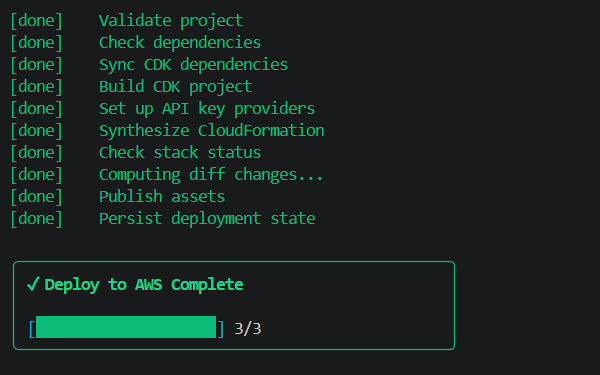
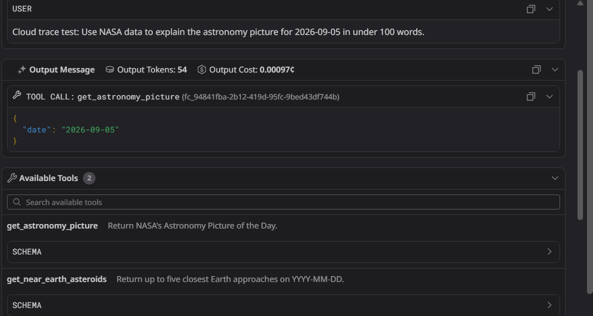
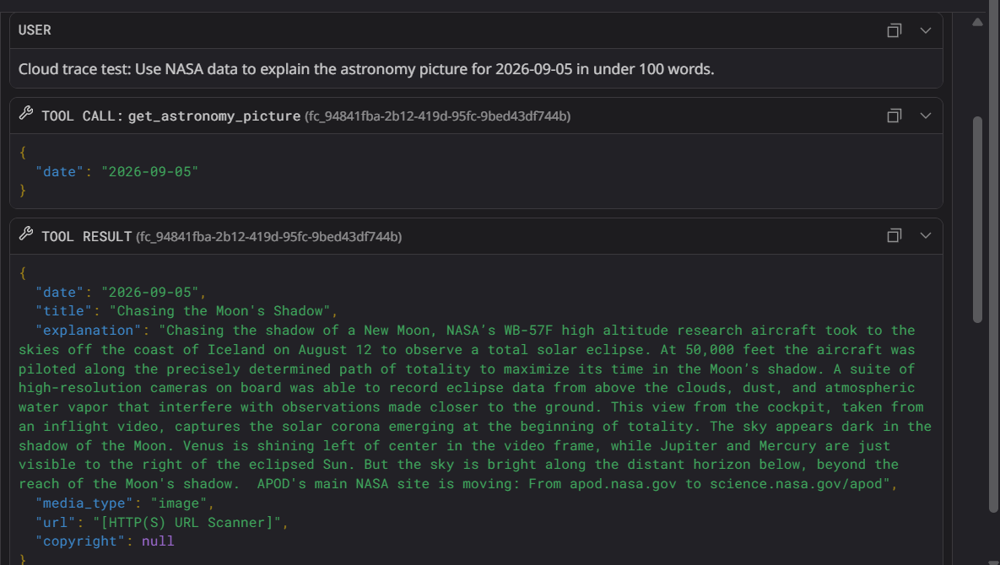
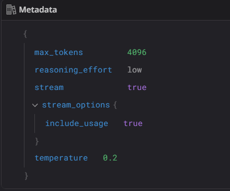

# Cosmic Explorer Agent

Cosmic Explorer is an astronomy assistant deployed on Amazon Bedrock AgentCore. It uses a Strands agent and Groq's OpenAI-compatible API to answer questions with live NASA data, and it sends LLM traces to Datadog when observability is configured.

The agent currently exposes two tools:

- `get_astronomy_picture` returns NASA's Astronomy Picture of the Day (APOD).
- `get_near_earth_asteroids` returns up to five of the closest Earth approaches for a requested date.

## Architecture

```text
User prompt
    |
    v
Amazon Bedrock AgentCore Runtime (HTTP, Python 3.12)
    |
    v
Strands Agent -----> Groq OpenAI-compatible model
    |
    +-------------> NASA APOD API
    |
    +-------------> NASA NeoWs API
    |
    +-------------> Datadog LLM Observability
```

## Repository layout

```text
.
|-- agentcore/
|   |-- agentcore.json              # AgentCore resource configuration
|   |-- aws-targets.example.json    # Safe deployment-target template
|   `-- cdk/                        # Generated AWS CDK application
|-- app/Nasa_agent1_agcore/
|   |-- main.py                     # AgentCore HTTP entrypoint
|   |-- requirements.txt            # Runtime dependencies
|   `-- cosmic_explorer_agent/
|       |-- agent.py                # Model, tools, and system prompt
|       `-- nasa_api.py             # NASA API tool implementations
|-- evals/
|   `-- run_evals.py                # Post-deployment quality checks
|-- Screenshots/                    # Deployment and trace examples
|-- .env.example                    # Local environment template
`-- AGENTS.md                       # AgentCore coding guidance
```

Generated dependencies, build output, deployment packages, evaluation results, and secret-bearing files are excluded by the root `.gitignore`.

## Prerequisites

- Python 3.12 (matching `agentcore/agentcore.json`)
- Node.js 20 or later
- `uv` or `pip`
- AWS CLI with credentials configured for the target account
- Amazon Bedrock AgentCore CLI
- A Groq API key
- A NASA API key (optional for low-volume use because `DEMO_KEY` is the fallback)
- A Datadog API key if LLM Observability is enabled

Confirm the main tools are available:

```bash
python --version
node --version
aws sts get-caller-identity
agentcore --help
```

## 1. Clone and enter the project

```bash
git clone https://github.com/ktam10/<repository-name>.git
cd <repository-name>
```

## 2. Configure local environment variables

Copy the example file and replace the placeholder values:

```bash
cp .env.example .env
```

PowerShell equivalent:

```powershell
Copy-Item .env.example .env
```

The application reads these variables:

| Variable | Required | Purpose |
| --- | --- | --- |
| `GROQ_API_KEY` | Yes | Authenticates the Groq OpenAI-compatible model endpoint. |
| `OPENAI_API_KEY` | Alternative | Used when `GROQ_API_KEY` is absent. It is still sent to the configured Groq endpoint. |
| `NASA_API_KEY` | No | Authenticates NASA APIs; defaults to `DEMO_KEY`. |
| `DD_API_KEY` | Local only | Enables local Datadog LLM Observability. |
| `DD_SITE` | No | Datadog site, defaulting to `datadoghq.com`. |

Never commit `.env`, `agentcore/.env.local`, or real API keys.

## 3. Create the Python environment

Using `uv`:

```bash
cd app/Nasa_agent1_agcore
uv venv
uv pip install -r requirements.txt
cd ../..
```

Using standard Python:

```bash
python -m venv app/Nasa_agent1_agcore/.venv
```

Activate it on macOS/Linux:

```bash
source app/Nasa_agent1_agcore/.venv/bin/activate
pip install -r app/Nasa_agent1_agcore/requirements.txt
```

Activate it on Windows PowerShell:

```powershell
app/Nasa_agent1_agcore/.venv/Scripts/Activate.ps1
pip install -r app/Nasa_agent1_agcore/requirements.txt
```

## 4. Configure the AWS deployment target

Create the local target file from the sanitized example:

```bash
cp agentcore/aws-targets.example.json agentcore/aws-targets.json
```

PowerShell equivalent:

```powershell
Copy-Item agentcore/aws-targets.example.json agentcore/aws-targets.json
```

Edit `agentcore/aws-targets.json` and set your 12-digit AWS account ID and preferred region. The current example uses `us-east-2`. This local file is intentionally gitignored.

## 5. Configure AgentCore credential providers

`agentcore/agentcore.json` declares these API-key providers:

| Provider | Runtime use |
| --- | --- |
| `agcorenasa1OpenAI` | Groq/model API key |
| `cosmicExplorerDatadog` | Datadog API key |

Configure both providers through the AgentCore CLI when prompted during deployment. Locally, the app instead reads the corresponding environment variables from `.env`.

## 6. Validate the project

Run validation before deploying:

```bash
agentcore validate
```

The configured runtime is a Python 3.12 `CodeZip` deployment, uses the HTTP protocol, and starts from `app/Nasa_agent1_agcore/main.py`.

## 7. Run locally

Start the AgentCore development runtime from the repository root:

```bash
agentcore dev
```

In another terminal, invoke it with a prompt:

```bash
agentcore invoke --local --json "Show today's NASA astronomy picture."
```

Example asteroid prompt:

```bash
agentcore invoke --local --json "List the closest Earth asteroid approaches for 2026-09-05."
```

## 8. Deploy to Amazon Bedrock AgentCore

Deploy the validated configuration:

```bash
agentcore deploy
```

The CLI validates the project, synchronizes CDK dependencies, builds the runtime package, synthesizes CloudFormation, publishes assets, and persists deployment state.



Check the deployed resource status:

```bash
agentcore status
```

## 9. Invoke the deployed agent

```bash
agentcore invoke --json "Use NASA data to explain the astronomy picture for 2026-09-05 in under 100 words."
```

The trace shows the model selecting `get_astronomy_picture` from the two registered NASA tools:



The tool returns structured NASA data to the agent:



The configured model metadata includes deterministic sampling and a bounded response size:



## 10. Run the evaluation suite

The evaluation script invokes the deployed runtime and checks five behaviors: APOD facts, closest asteroid, asteroid count and names, asteroid diameter, and correct handling of missing copyright data.

From the repository root, run:

```bash
python evals/run_evals.py
```

Reports are written to `evals/results/`. They are generated runtime output and are not committed.

## 11. Inspect logs and traces

```bash
agentcore logs
agentcore traces list
```

If Datadog is configured, open LLM Observability to inspect the `cosmic_explorer_request` workflow, prompt and response annotations, model metadata, tool calls, latency, and token usage.

## Security notes

- Do not commit `.env`, `agentcore/.env.local`, or `agentcore/aws-targets.json`.
- Do not put API keys directly in `agentcore.json` or source code.
- Use AgentCore Identity credential providers for deployed secrets.
- Treat NASA API responses as external data, not instructions.
- The asteroid tool reports close-approach measurements, not collision probabilities.
- Review screenshots before publishing; cloud account IDs, resource ARNs, and session identifiers can be visible in observability UIs.

## Reproducing the GitHub repository setup

The local repository can be initialized and published with:

```bash
git init
git branch -M main
git add .
git commit -m "Initial commit: Cosmic Explorer Agent"
git remote add origin https://github.com/ktam10/<repository-name>.git
git push -u origin main
```

Create the empty GitHub repository before the final two commands, and do not initialize it with a separate README, `.gitignore`, or license because those files already exist locally.

## References

- [AgentCore CLI](https://github.com/aws/agentcore-cli)
- [AgentCore CDK constructs](https://github.com/aws/agentcore-l3-cdk-constructs)
- [Amazon Bedrock AgentCore](https://aws.amazon.com/bedrock/agentcore/)
- [NASA Open APIs](https://api.nasa.gov/)
- [Strands Agents](https://strandsagents.com/)
